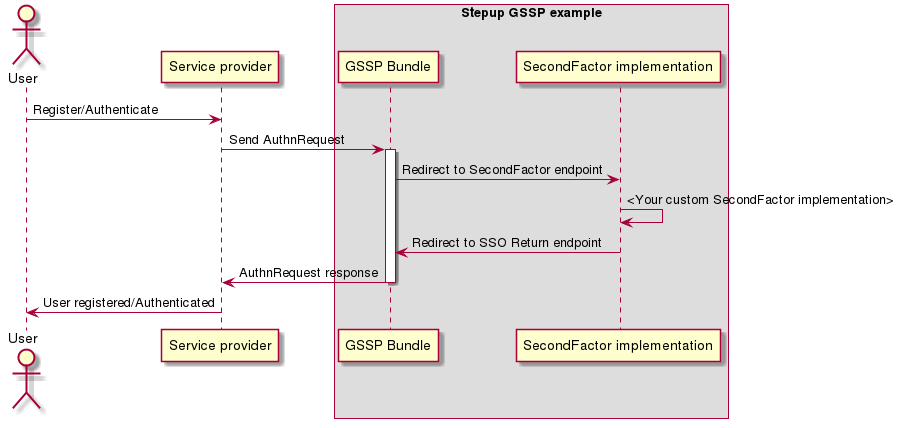

Stepup-gssp-example
===================

<a href="#">
    
</a></br>

Example Generic SAML Stepup Provider.

This repository can be used for reference material or 
as a base project setup for new IdP SecondFactor application.

The SAML logic for receiving authentication request (AuthnRequest) and sending authentication response back is
placed inside the Symfony bundle [stepup-gssp-bundle](https://github.com/OpenConext/Stepup-gssp-bundle). The state of the
application is stored inside PHP sessions, each new request will invalidate the current session state.

Locale user preference
----------------------

The default locale is based on the user agent. When the user switches its locale the selected preference is stored inside a
browser cookie (stepup_locale). The cookie is set on naked domain of the requested domain (for demogssp.dev.openconext.local this is example.com).

Authentication and registration flows
-------------------------------------

The application provides internal (SpBundle) and a remote service provider. Instructions for this are given 
on the homepage of this example project [Homepage](https://demogssp.dev.openconext.local/).


<!---
regenerate docs/flow.png with `plantum1 README.md` or with http://www.plantuml.com/plantuml
@startuml docs/flow
actor User
participant "Service provider" as SP
box "Stepup GSSP example"
participant "GSSP Bundle" as IdP
participant "SecondFactor implementation" as App
end box
User -> SP: Register/Authenticate
SP -> IdP: Send AuthnRequest
activate IdP
IdP -> App: Redirect to SecondFactor endpoint
App -> App: <Your custom SecondFactor implementation>
App -> IdP: Redirect to SSO Return endpoint
IdP -> SP: AuthnRequest response
deactivate IdP
SP -> User: User registered/Authenticated
@enduml
--->


How to create your own Stepup Provider
======================================

There are two ways to approach this. 

Copy this GSSP example repository
---------------------------------

One of the benefits of using this repository is that it contains many pre-configured tools:

* Metrics & test tooling [testing.md](./docs/testing.md)
* Development environment provisioned by Vagrant 
* Pre-configured travis.yml for CI integration
* Default SurfContext styling [frontend_tooling.md](./docs/frontend_tooling.md)

1) Clone and checkout this repository
2) Change the project configuration variables:
    * composer.json name and description
    * this readme.md file
    * Replace 'demogssp.dev.openconext.local' in all files with your own hostename
3) Install the copied project. (See [Development environment](#) section of this README.md file)
4) Implement your authentication & registration logic in DefaultController::registrationAction and DefaultController::authenticateAction. 
5) Feel free to rename and change this example clone for your needs.

Install from a clean or exiting symfony project
------------------------------------

1) [Install Symfony](http://symfony.com/doc/current/setup.html) 
2) Follow the instructions from the [GSSP bundle](https://github.com/OpenConext/Stepup-gssp-bundle)

Setting the desired Symfony application environment
===================================================
There are 2 ways you can influence the desired Symfony application environment.

1. Set the `app_env` parameter in `config/openconext/parameters.yaml` to `dev`, `test` or `prod`
2. Override the `app_env` param by providing an environment variable named `APP_ENV`

- The default value for the application environment will be `prod`
- Do not try to use a .env file to override the `app_env` param. That file will not be evaluated by Symfony as we decided not use the DotEnv component.

Development environment
======================

The purpose of the development environment is only for running the different test and metric tools.

To get started, first setup the development environment. The development environment is a docker container. That is
controlled via the [OpenConext-devconf](https://github.com/OpenConext/OpenConext-devconf/) project.

Every task described below should be run from that container.

Requirements
-------------------
- Docker
- OpenConext-devconf

Install
-------------------
**Copy the parameters.yaml**

`$ cp config/openconext/parameters.yaml.dist config/openconext/parameters.yaml`

**Bring up the container in dev-mode**
From you dev-conf installation start the `stepup` dev-env with AzureMFA in dev mode

For example:

```bash
cd stepup
./start-dev-env.sh demogssp:../../OpenConext-stepup/Stepup-gssp-example
```

**Building frontend assets:**

`$ yarn encore dev`

or

`$ yarn encore prod`

for production


If everything goes as planned you can go to:

[https://demogssp.dev.openconext.local](https://demogssp.dev.openconext.local/)

Debugging
-------------------
Xdebug is configured when provisioning your development Vagrant box. 
It's configured with auto connect IDE_KEY=phpstorm. 

Tests and metrics
======================

To run all required test you can run the following commands from the dev env:

```bash 
    composer test 
```

Every part can be run separately. Check "scripts" section of the composer.json file for the different options.

Release instructions
=====================

Please read: https://github.com/OpenConext/Stepup-Deploy/wiki/Release-Management for more information on the release strategy used in Stepup projects.

Other resources
======================

 - [Developer documentation](docs/index.md)
 - [Issue tracker](https://www.pivotaltracker.com/n/projects/1163646)
 - [License](LICENSE)
